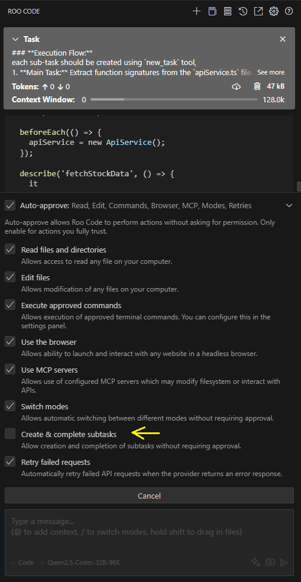
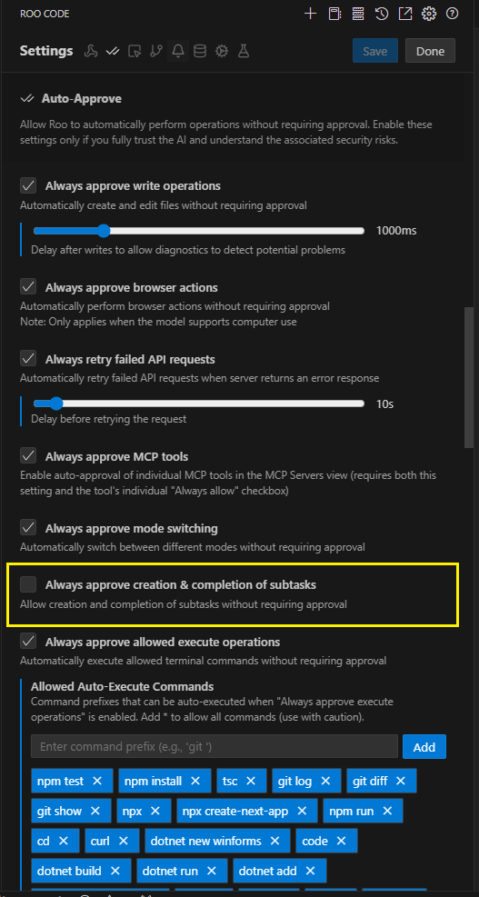

# Using `sub-task` feature (`new_task`  Tool)

## Overview

The `new_task` tool (also known as "Boomerang Tasks") allows Roo to break down a main task into smaller, independent sub-tasks. Each sub-task is executed in a fresh context, ensuring:

- Reduced AI hallucinations
- Eliminated context overflow
- Prevention of lengthy prompt cut-offs
- Improved accuracy and adherence to the main goal

Sub-tasks return their results to the parent task, which then continues execution seamlessly.

## How It Works

There are no buttons or settings required to enable this feature. Roo Code automatically decides when to use `new_task` if a task can be broken down into smaller, standalone sub-tasks. However, you can instruct Roo Code explicitly to use this feature.

## How to Use `new_task`

### 1. Instruct Roo Code to Break Down a Task

You can request Roo Code to decompose a task into sub-tasks and execute each separately.

**📌 Example Prompt:**

```plaintext
Write a Python script that lists all files in the current folder and writes the result into a text file. Then, create a Windows batch file to run this Python script. Lastly, create a folder named 'test1' and move both the Python script and the batch file into the folder. Break this task into independent sub-tasks and execute each using the `new_task` tool.
```

### 2. Provide a List of Tasks to Execute

If you prefer to manually define sub-tasks, list them explicitly and ask Roo to execute each using `new_task`.

**📌 Example Prompt:**

```plaintext
Execute each of the following tasks using the `new_task` tool:

1. Write a Python script (`list_files.py`) that lists all files in the current folder and writes them into `files.txt`.
2. Run the script (`list_files.py`).
3. Edit `files.txt` to ensure each line contains only a file name.
4. Count the number of files in the current folder and append the count to `files.txt`.
```

### 3. Using Task Files for Execution

Instead of listing tasks in the prompt, you can:

1. Write each task in a separate text file (e.g., `task1.txt`, `task2.txt`).
2. Store them in a folder  (e.g., `tasks`)..
3. Instruct Roo Code to loop through the folder and execute each task using `new_task`.

**📌 Example Prompt:**

```plaintext
Loop through all task files in the folder `tasks` and execute each task using the `new_task` tool.
```

<br/>

## Persistent Execution with Review and Approval

You can enable approval before moving to the next sub-task using the **Auto-Approve Panel** (found at the bottom of Roo's Code panel, above the chat text area). This allows you to review each sub-task before it is declared as Done and control is returned to the main parent task to continue execution rest of the sub-tasks.

At this point you can review the task, make sure it went as planned, write further instructions to Roo Code so it can fix or change whatever you wish to fix in the Sub-Task, and when done - press the Approve button.




<br/>

Beside controlling the end sub-task (and return control to parent / calling task) from the 'Auto-Approve' panel, you can setup this checkbox from withing the Roo Code Settings panel, use the gear icon from the top right corner of the extension panel and scroll down to the 'Auto Approve' section.

<br/>



## Sub-Task execution plan

The parent task can create a sub-tasks to execute smaller workload segments, and a sub-task can also spawn additional sub-tasks to break the work further into even smaller parts.

This can be achieved using the following prompt:

**📌 Example Prompt:**

```plaintext
### **Execution Flow:**
each sub-task should be created using `new_task` tool,
1. **Main Task:** Extract function signatures from the `apiService.ts` file.
2. **For each function:**
   - Call **Sub-task 1** (Add comments).
   - Call **Sub-task 2** (Write Jest test).
     - **Nested Sub-task 2.1** (Run Jest test and return results).
```

<br/>

```mermaid
graph TD
    A[Main Task: Extract Function Signatures] -->|For each function| B[Sub-task 1: Add Comments]
    A -->|For each function| C[Sub-task 2: Write Jest Test]
    C --> D[Sub-task 2.1: Run Jest Test]
    D -->|✅ All Tests Passed| E[Return Success]
    D -->|❌ Test Failed| F[Return Error Message]
```

---
<br/>
<br/>
<br/>

## 📝 Side note:

### **Understanding Lengthy Prompt Cut-offs**

### What is a Lengthy Prompt Cut-off?

When an AI receives a very long prompt, it may be truncated due to token limits, leading to incomplete instructions or missing details. This can cause the AI to forget key parts of the task, resulting in errors or misinterpretation.

### Why Does This Happen?

- Most AI models have a **token limit**, meaning they can only process a certain amount of text at once.
- If a prompt exceeds this limit, the model may **cut off** important instructions at the end.
- This leads to **forgetfulness** or **misinterpretation** of the original request.

### How `new_task` Helps Prevent This

By breaking a large task into smaller, self-contained sub-tasks:

- Each sub-task fits within the AI’s token limit.
- The AI does not need to remember the entire context of the main task.
- Prompts remain concise, improving accuracy and reducing the chance of AI forgetfulness.

---

By leveraging the `new_task` tool, you ensure optimized, structured, efficient, and error-free execution of complex tasks in Roo Code.

